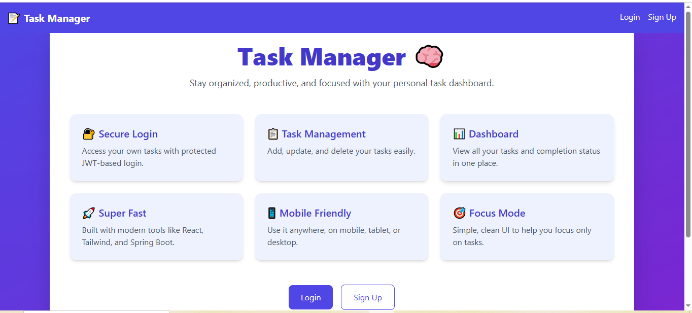
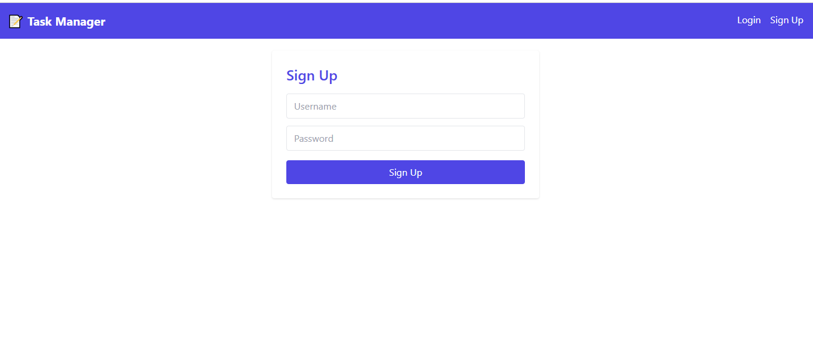
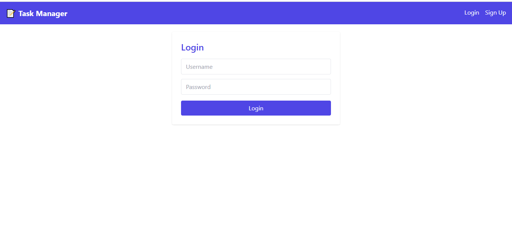
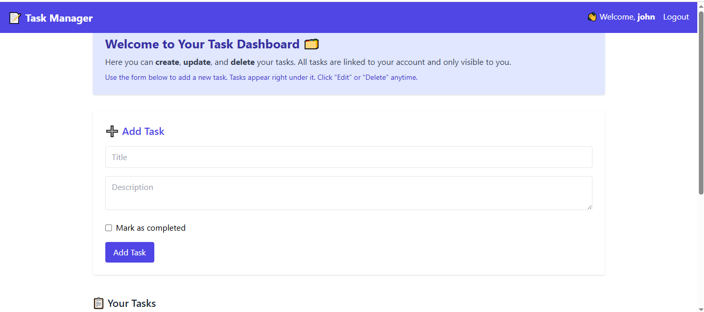
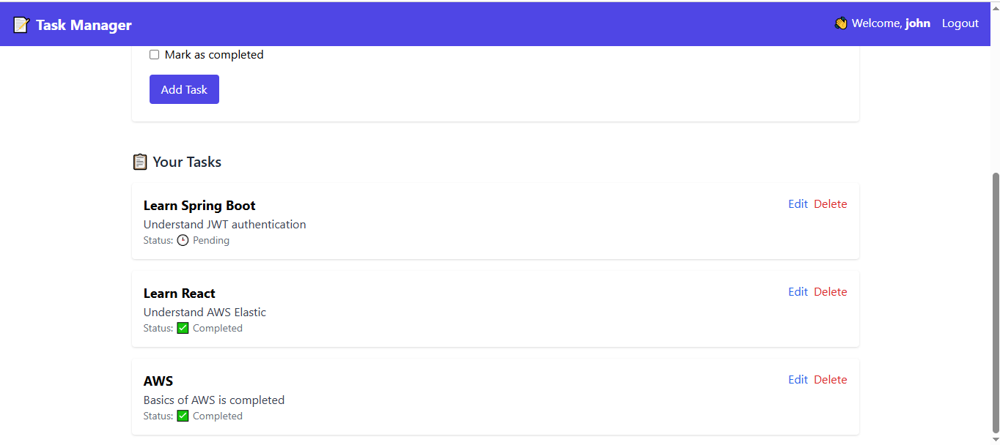

📝 Task Manager App
-------------------------------------------------

A full-stack Task Management application built using Spring Boot (Backend) and React (Frontend) with JWT-based Authentication. Users can register, log in, and manage their tasks (Create, Read, Update, Delete). Authenticated users can access only their own tasks.

🚀 Features
-------------------------------------------------

✅ User Signup & Login with JWT Authentication

✅ Secure API with Spring Security

✅ Role-based access (each user can manage only their tasks)

✅ Add, Update, Delete, View tasks

✅ Beautiful Dashboard UI with Toast Notifications

✅ Protected Routes in React

✅ MySQL database integration

✅ Responsive UI with Tailwind CSS

✅ JWT stored in Localstorage

✅ Toast messages for login/signup feedback

🏗️ Project Structure
-------------------------------------------------

📆 Backend - Spring Boot
-------------------------------------------------

```
src/
├── config/              # Security and JWT Configuration
│   ├── JwtUtil.java
│   ├── JwtFilter.java
│   └── SecurityConfig.java
├── controller/
│   ├── AuthController.java
│   └── TaskController.java
├── entities/
│   ├── User.java
│   └── Task.java
├── repository/
│   ├── UserRepository.java
│   └── TaskRepository.java
├── service/
│   ├── CustomUserDetailsService.java
│   └── TaskService.java
└── TaskManagementApplication.java
```

🌐 Frontend - React
-------------------------------------------------
```
src/
├── pages/
│   ├── Login.jsx
│   ├── Signup.jsx
│   └── Dashboard.jsx
├── components/
│   ├── Navbar.jsx
│   ├── ProtectedRoute.jsx
│   └── TaskForm.jsx
├── context/
│   └── AuthContext.js
├── api/
│   └── api.js
└── App.js
```
🛠️ Technologies Used

###Backend:
-------------------------------------------------

• Spring Boot

• Spring Security

• JWT (jjwt 0.11.5)

• MySQL

• Maven

###Frontend:
-------------------------------------------------

• React.js

• React Router DOM

• Axios

• Tailwind CSS

• React Toastify


✅ Setup Instructions
-------------------------------------------------

🔹 1. Clone the repository
```
git clone https://github.com/your-username/task-manager-app.git
cd task-manager-app
```
🔧 Backend Setup (Spring Boot)
-------------------------------------------------

🔸 Prerequisites

JDK 21

MySQL

Maven

🔸 Steps

Create a MySQL database named task

Update your DB credentials in application.properties
```
spring.datasource.username=root
spring.datasource.password=yourpassword
spring.jpa.hibernate.ddl-auto=update
spring.datasource.url=jdbc:mysql://localhost:3306/task
server.port=9090
```
Install dependencies and run
```
mvn clean install
mvn spring-boot:run
```
The backend will run at``` http://localhost:9090```

🌐 Frontend Setup (React)
-------------------------------------------------

🔸 Prerequisites

Node.js & npm

🔸 Steps
```
cd frontend
npm install
npm start
```
React will run at http://localhost:3000

📬 API Endpoints
-------------------------------------------------

| Method | Endpoint         | Description       |
| ------ | ---------------- | ----------------- |
| POST   | `/auth/register` | Register a user   |
| POST   | `/auth/login`    | Login and get JWT |
| GET    | `/tasks`              | Get user tasks    |
| POST   | `/tasks`         | Create a task     |
| PUT    | `/{id}`   | Update a task     |
| DELETE | `/{id}`   | Delete a task     |


🔐 All routes except ```/auth/*``` are JWT protected


🔒 Authentication Flow
--------------------------------------------------------
After login, token is stored in localStorage.

Axios automatically sends JWT in ```Authorization: Bearer <token>``` header.

Spring Security filters requests and authenticates users.

📸 Screenshots
-------------------------------------------------







✍️ Author
-------------------------------------------------

Dilip Yadav

📢 Connect on LinkedIn
-------------------------------------------------

Feel free to connect :🔗 (https://www.linkedin.com/in/dilip-yadav-2a0765244)

